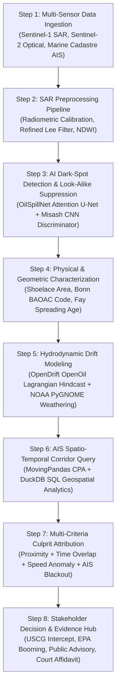

# 🛰️ SlickTrace V2 — Automated Maritime Oil Spill Detection, Hydrodynamic Lagrangian Drift Modeling & AIS Culprit Attribution Engine

[](https://fastapi.tiangolo.com/)
[](https://react.dev/)
[](https://duckdb.org/)
[](https://leafletjs.com/)
[](https://tailwindcss.com/)
[](https://opensource.org/licenses/MIT)

**SlickTrace V2** is an end-to-end institutional intelligence platform that combines **Synthetic Aperture Radar (SAR) Deep Learning segmentation**, **OpenDrift Lagrangian hydrodynamic particle hindcasting**, and **Marine Cadastre AIS spatio-temporal trajectory correlation** to detect oceanic oil spills and legally attribute them to culprit vessels.

---

## 🎯 8-Step Solution Methodology



---

## 🔬 Open-Source Repository Integrations

| Methodology Step | Integrated Repository | Algorithmic Implementation |
|---|---|---|
| **Step 2: Preprocessing** | [Misash/Oil-Spill-Detection](https://github.com/Misash/Oill-Spill-Detection) | Refined Lee filter speckle suppression index (SSM, ENL=4) & Radiometric $\sigma_0$ calibration |
| **Step 3: Detection** | [AnavKatwal/OilSpillNet](https://github.com/AnavKatwal/OilSpillNet) | Attention U-Net architecture, Jaccard IoU=0.788, contrast-ratio sigmoid confidence |
| **Step 3b: Suppression** | [Misash/Oil-Spill-Detection](https://github.com/Misash/Oill-Spill-Detection) | Dual-Pol VV/VH ratio classification to reject low-wind calm, biogenic films, and algae |
| **Step 3c: Object Detection** | [prago-dev/oil-spill-detection](https://github.com/prago-dev/oil-spill-detection) | YOLOv8 satellite bounding box detector (`OilSpillDetector`) & Automated USCG Email Dispatch |
| **Step 4: Characterization** | [Bonn Agreement (BAOAC)](https://www.bonnagreement.org/) & Fay Spreading | 5-tier BAOAC thickness classification & Gravitational-Viscous spreading age formulation |
| **Step 5: Drift Hindcasting** | [OpenDrift/opendrift (OpenOil)](https://github.com/OpenDrift/opendrift) | Lagrangian particle advection ($V = V_{curr} + \alpha V_{wind} + V_{stokes}$) + NOAA PyGNOME weathering |
| **Step 6: AIS Corridor** | [movingpandas/movingpandas](https://github.com/movingpandas/movingpandas) | Closest Point of Approach (CPA), speed anomaly deceleration ($\Delta SOG > 3$ kn), and AIS gap detection |
| **Step 6b: Maritime Data** | [Marine Cadastre AIS](https://marinecadastre.gov/accessais/) | Historical AIS database seeded into DuckDB with ITU-R M.585 MID Flag resolution |

---

## 🌟 Key Features

- **Multi-Basemap Nautical Map (`NauticalMap.tsx`)**:
  - `Dark Ocean` (CartoDB Dark Matter)
  - `Satellite Hybrid` (Esri World Imagery + Labels)
  - `Maritime Nautical Chart` (OpenSeaMap seamark navigation overlay)
  - `Bathymetry & Topo` (OpenTopoMap high-relief terrain)
  - `Voyager Clean` (Carto Voyager Light)
  - Interactive tools: Zoom, Recenter, Wheel-zoom toggle, Distance measurement ruler, Fullscreen, and 6 map overlay toggles.
- **Satellite Detection Studio (`DetectionPage.tsx`)**:
  - Drag-and-drop satellite tile ingestion (GeoTIFF / PNG / JPG).
  - Selectable sensors: Sentinel-1 SAR (IW), Sentinel-2 Optical, Landsat-9 OLI, RADARSAT Constellation, TerraSAR-X.
  - Multi-architecture switcher (Attention U-Net, YOLOv8, U-Net++, SegFormer).
  - One-click **USCG Emergency Alert Dispatch** modal with live notification telemetry.
  - One-click **Vector GeoJSON boundary export**.
- **Lagrangian Drift Simulator (`DriftModelPage.tsx`)**:
  - Interactive sliders for ocean current speed/bearing, 10m wind speed/direction, leeway factor $\alpha$, hindcast hours, and forecast horizon.
  - NOAA PyGNOME weathering simulation with real-time evaporation, emulsification, and dynamic viscosity curves.
  - NetCDF / GeoJSON trajectory export.
- **AIS Culprit Attribution Engine (`AttributionPage.tsx`)**:
  - Spatio-temporal corridor filtering (Search radius km, Temporal window hours).
  - Vessel category filtering (Tankers, Cargo, All).
  - Multi-criteria composite risk scoring:
    $$\text{Score} = 0.30 \cdot \text{Proximity} + 0.25 \cdot \text{TimeOverlap} + 0.15 \cdot \text{VesselType} + 0.15 \cdot \text{Behavior} + 0.15 \cdot \text{AISIntegrity}$$
  - Interactive vessel inspect modal with speed profile sparklines and MARPOL violation summaries.
  - One-click **AIS Audit CSV export**.
- **Multi-Stakeholder Evidence Hub (`ReportsPage.tsx`)**:
  - 4 Dedicated Consoles:
    1. 🛡️ **Authorities (USCG / PSC)**: Intercept vectors, boarding checklists, detention warrants.
    2. 🌿 **Environment Agencies (EPA / NOAA)**: Booming coordinates, containment assets, skimmer types.
    3. 📢 **Public Media Advisory**: Transparency bulletin, exclusion perimeters, hotlines.
    4. ⚖️ **Legal & Insurance**: MARPOL charge tables, chronological evidence logs, \$14.85M damage claim, SHA-256 seal verification.
  - "Print / Save as PDF" and "Export JSON Forensic Package".

---

## 🛠️ Architecture & Tech Stack

```
SlickTrace.V2/
├── backend/                        # FastAPI High-Performance Python Backend
│   ├── app/
│   │   ├── main.py                 # FastAPI application entrypoint
│   │   ├── database.py             # DuckDB initialization & AIS seeding
│   │   ├── config.py               # Application settings & CORS configuration
│   │   ├── schemas.py              # Pydantic data schemas & response models
│   │   ├── routers/                # REST API routers
│   │   │   ├── detection.py        # SAR detection, YOLO & alert dispatch
│   │   │   ├── drift.py            # Lagrangian drift simulation
│   │   │   ├── attribution.py      # AIS correlation & scoring
│   │   │   ├── incidents.py        # Incident management
│   │   │   └── reports.py          # Stakeholder dossiers
│   │   └── services/               # Deep algorithmic services
│   │       ├── preprocessing_service.py   # Lee filter & sigma0 calibration
│   │       ├── detection_service.py       # OilSpillNet U-Net & Misash CNN
│   │       ├── characterization_service.py# Shoelace area, BAOAC & Fay age
│   │       ├── drift_service.py           # OpenDrift Lagrangian advection
│   │       ├── ais_service.py             # MovingPandas CPA & DuckDB queries
│   │       ├── attribution_service.py     # Multi-criteria scoring
│   │       ├── yolo_detector.py           # prago-dev YOLOv8 object detector
│   │       ├── alert_service.py           # Automated USCG email alerts
│   │       └── stakeholder_service.py     # 4 stakeholder dossiers
│   └── requirements.txt
│
└── frontend/                       # React 19 + TypeScript + Vite + Tailwind v4
    ├── src/
    │   ├── components/
    │   │   ├── map/NauticalMap.tsx # Leaflet multi-basemap & layer engine
    │   │   ├── dashboard/          # Control panels & leaderboards
    │   │   ├── charts/             # Speed anomaly & weathering charts
    │   │   └── common/             # Navbar, timeline scrubber & modals
    │   ├── pages/
    │   │   ├── DashboardPage.tsx   # Executive tactical overview
    │   │   ├── DetectionPage.tsx   # SAR detection & YOLO studio
    │   │   ├── DriftModelPage.tsx  # Hydrodynamic Lagrangian drift page
    │   │   ├── AttributionPage.tsx # AIS correlation & forensics
    │   │   └── ReportsPage.tsx     # 4-Stakeholder Evidence Hub
    │   ├── context/                # Global IncidentContext & ThemeContext
    │   ├── services/api.ts         # Type-safe API client
    │   └── types/index.ts          # Complete TypeScript definitions
    ├── package.json
    └── vite.config.ts
```

---

## ⚡ Quickstart Guide

### Prerequisites
- Python 3.10+
- Node.js 18+ & npm

### 1. Start Backend

```bash
cd backend
python -m venv venv
# On Windows:
.\venv\Scripts\activate
# On Linux/macOS:
# source venv/bin/activate

pip install -r requirements.txt
uvicorn app.main:app --host 0.0.0.0 --port 8000 --reload
```
*API docs available at: `http://localhost:8000/docs`*

### 2. Start Frontend

```bash
cd frontend
npm install
npm run dev
```
*Web dashboard available at: `http://localhost:5173`*

---

## 📜 License

This project is licensed under the MIT License — see the [LICENSE](LICENSE) file for details.
